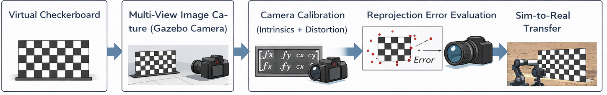

# Robotics: From Sim to Real in Digital Twins

## Introduction
In Digital Twins, it is essential to replicate real-world sensors such as cameras with high fidelity in a virtual environment. A Digital Twin aims to mirror the physical system as closely as possible, enabling accurate simulation, analysis, and validation before real-world deployment.

Camera calibration plays a critical role in this process, as it ensures that the simulated camera behaves consistently with its real-world counterpart. Without proper calibration, the mapping between 3D world coordinates and 2D image projections becomes inaccurate, leading to errors in perception, localization, and downstream robotic tasks.

In this project, we perform camera calibration using a checkerboard pattern in a Gazebo simulation environment. The goal is to establish a reliable calibration pipeline that not only works in simulation but can also be transferred to real-world robotic systems, thereby bridging the gap between simulation and reality in a Digital Twin framework. 

---

## Aim
The aim of this project is to perform accurate intrinsic camera calibration within a Gazebo simulation environment using a checkerboard pattern, while quantitatively validating the calibration quality through reprojection error analysis. Furthermore, the project seeks to develop a robust and reliable calibration pipeline that can be seamlessly transferred from simulation to real-world robotic systems, thereby enabling a consistent Sim-to-Real transition.

---

## Problem Statement
Simulated cameras often lack realistic noise characteristics, resulting in overly ideal conditions that do not reflect real-world sensing. Additionally, while simulation environments assume perfect geometry, real cameras exhibit lens distortions and imperfections that affect calibration accuracy. These discrepancies make it challenging to ensure calibration robustness across different domains, particularly when transitioning from simulation to real-world deployment. Furthermore, there is currently no standardized pipeline for achieving reliable Sim-to-Real camera calibration transfer, which further complicates the process.

---

## Existing Literature
- Tobin, J., Fong, R., Ray, A., Schneider, J., Zaremba, W., & Abbeel, P. (2017). Domain randomization for transferring deep neural networks from simulation to the real world. In *Proceedings of the IEEE/RSJ International Conference on Intelligent Robots and Systems (IROS)* (pp. 23–30). https://doi.org/10.1109/IROS.2017.8202133  

- Andrychowicz, M., Baker, B., Chociej, M., Józefowicz, R., McGrew, B., Pachocki, J., … Zaremba, W. (2020). Learning dexterous in-hand manipulation. *The International Journal of Robotics Research, 39*(1), 3–20. https://doi.org/10.1177/0278364919887447  

- OpenAI, Akkaya, I., Andrychowicz, M., Chociej, M., Litwin, M., McGrew, B., … Zaremba, W. (2019). Solving Rubik’s Cube with a robot hand. *arXiv preprint arXiv:1910.07113*.  

- Peng, X. B., Andrychowicz, M., Zaremba, W., & Abbeel, P. (2018). Sim-to-real transfer of robotic control with dynamics randomization. In *Proceedings of the IEEE International Conference on Robotics and Automation (ICRA)* (pp. 3803–3810). https://doi.org/10.1109/ICRA.2018.8460528  

- James, S., Davison, A. J., & Johns, E. (2019). Transferring end-to-end visuomotor control from simulation to real world for a multi-stage task. In *Proceedings of the Conference on Robot Learning (CoRL)* (pp. 334–343).  

- Zhao, W., Queralta, J. P., & Westerlund, T. (2020). Sim-to-real transfer in deep reinforcement learning for robotics: A survey. In *IEEE Symposium Series on Computational Intelligence (SSCI)* (pp. 737–744). https://doi.org/10.1109/SSCI47803.2020.9308213  

- Muratore, F., Gienger, M., & Peters, J. (2021). Domain randomization for simulation-to-real transfer. *IEEE Robotics and Automation Letters, 6*(2), 2051–2058. https://doi.org/10.1109/LRA.2021.3060394  

- Tremblay, J., Prakash, A., Acuna, D., Brophy, M., Jampani, V., Anil, C., … Birchfield, S. (2018). Training deep networks with synthetic data: Bridging the reality gap by domain randomization. In *Proceedings of the IEEE Conference on Computer Vision and Pattern Recognition Workshops (CVPRW)*.  

- Sadeghi, F., & Levine, S. (2017). CAD2RL: Real single-image flight without a single real image. In *Proceedings of Robotics: Science and Systems (RSS)*.  

- Hwangbo, J., Lee, J., & Hutter, M. (2019). Learning agile and dynamic motor skills for legged robots. *Science Robotics, 4*(26), eaau5872. https://doi.org/10.1126/scirobotics.aau5872  

---

## Our Approach
The proposed pipeline begins with a virtual checkerboard of known dimensions placed within the Gazebo simulation environment. A simulated camera captures multiple images of the checkerboard from diverse viewpoints, ensuring sufficient variation in perspective. These images are then processed using OpenCV to detect and refine checkerboard corner features. Using the detected 2D image points and corresponding 3D world coordinates, camera calibration is performed to estimate intrinsic parameters and lens distortion coefficients. The quality of calibration is subsequently evaluated through reprojection error analysis, which quantifies the difference between observed and projected points. Finally, the validated calibration pipeline is extended toward Sim-to-Real transfer, enabling its application to real-world camera systems while maintaining consistency with the simulated setup.

  
   
  <em>Figure: Sim-to-Real Camera Calibration Pipeline</em>

---

## Implementation Steps

1. Launch Gazebo simulation environment
2. Spawn a checkerboard model with known square dimensions
3. Attach or position a camera sensor in the simulation
4. Capture multiple images from different angles and distances
5. Save captured images to a dataset folder

6. Install required dependencies:
   - Python 3.x
   - OpenCV (cv2)
   - NumPy

7. Define checkerboard parameters:
   - Number of inner corners (rows, columns)
   - Square size (in meters)

8. Detect checkerboard corners in each image:
   - Convert image to grayscale
   - Use cv2.findChessboardCorners()
   - Refine corners using cv2.cornerSubPix()

9. Store object points (3D world coordinates)
10. Store image points (2D detected corners)

11. Perform camera calibration:
    - Use cv2.calibrateCamera()
    - Obtain:
        * Camera matrix
        * Distortion coefficients
        * Rotation and translation vectors

12. Compute reprojection error:
    - Project 3D points back to image plane
    - Measure difference from detected points

13. Save calibration parameters:
    - Store in YAML / JSON file

14. Validate calibration:
    - Undistort sample images using cv2.undistort()
    - Visually inspect correction quality

15. (Optional) Transfer pipeline to real camera:
    - Capture real checkerboard images
    - Repeat calibration steps
   
    ---

## Results and Discussions

## Results

### 1. Experimental Setup

Camera calibration was performed for both a real-world camera and a simulated camera in Gazebo under three different lighting conditions: **normal**, **dark**, and **bright**. A checkerboard-based calibration approach was used to estimate the intrinsic camera matrix \(K\) in each case.

---

### 2. Intrinsic Parameter Estimation

#### 🔹 Real Camera
K =
[ 443.1745 0 330.6470
0 444.2642 239.7898
0 0 1.0000 ]

#### 🔹 Simulated (Normal Lighting)

K =
[ 420.8547   0        319.9706
  0        420.8222   240.4167
  0          0          1.0000 ]

#### 🔹 Simulated (Dark Lighting)

K =
[ 420.7664 0 320.0425
0 420.7587 240.3340
0 0 1.0000 ]

#### 🔹 Simulated (Bright Lighting)

K =
[ 420.0243 0 319.9977
0 419.9947 240.4796
0 0 1.0000 ]

---

### 3. Quantitative Evaluation

To measure the Sim-to-Real gap, the percentage error between simulated and real intrinsic parameters was computed:

| Condition       | fx (%) | fy (%) | cx (%) | cy (%) |
|-----------------|--------|--------|--------|--------|
| Normal Lighting | 5.03   | 5.28   | 3.23   | 0.26   |
| Dark Lighting   | 5.05   | 5.29   | 3.21   | 0.23   |
| Bright Lighting | 5.23   | 5.47   | 3.22   | 0.29   |

---

### 4. Analysis

The results highlight a consistent discrepancy between simulated and real camera intrinsics:

- The focal lengths (\(f_x, f_y\)) exhibit a stable deviation of approximately **5%**, indicating a systematic difference in effective field-of-view between simulation and reality.  
- The principal point coordinates (\(c_x, c_y\)) show significantly lower error (**≤ 3.3%**), suggesting accurate alignment of the image center in the simulation.  
- Across all lighting conditions, the variation in intrinsic parameters is negligible, demonstrating that **lighting changes do not significantly affect geometric calibration**.

---

### 5. Key Observations

- ✅ **Geometric Stability:** Intrinsic parameters remain consistent across lighting variations  
- ⚠️ **Systematic Focal Length Gap (~5%):** Indicates mismatch in camera modeling (FOV / optics)  
- ✅ **Accurate Principal Point Alignment:** Simulation closely matches real-world image centering  
- 🔍 **Photometric vs Geometric Decoupling:** Lighting affects appearance but not intrinsic calibration  

---

### 6. Conclusion

> The experimental results demonstrate that while the simulated camera maintains strong geometric consistency across varying lighting conditions, a persistent ~5% deviation in focal length highlights a critical Sim-to-Real gap. This suggests that improving intrinsic camera modeling—particularly field-of-view and optical characteristics—is essential for achieving high-fidelity Digital Twin representations.

